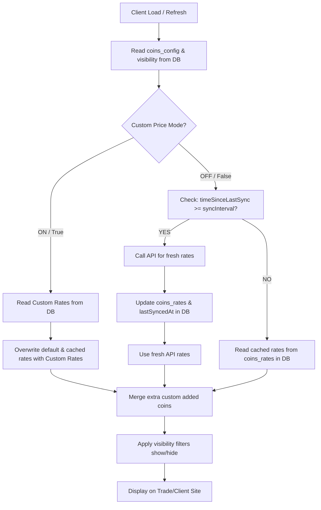

# Coins Api Settings
jitni bhi coins ki price api se a rahi he wesy hi tabs k sath admin panel me option bana k dikhane hen udher har tabs k andar ek ek toggle button bana den wo button custom price set karnny k liye ho ga ager toggle on ho to api se data load ho warna admin her currency ka khud se custom rate set kar saky or off hony per wohi custom rates show ho client side per . or dosra button banaen syncing time ka time field k sath. wo data api se client side per load ho ga keh kitni der baad is tab ka data load ho like 30 minut baad 5 ghanty baad jo k seconds me likh saky.

# Coins Data Fetching Flow:
abh data k flow ki baat ap ko bataty hen kesa ho ga . currenlty data her coins k rates ka teeno tabs ka apis se load ho kar client side per show hota he but abh jo admin ne time set kiya ho ga us time k baaad data load ho ga or wo data database me bhi store ho ga or client side per bhi show ho ga ek conditon lagy gi jo k time ko check kary ga k pahly wala time ka gap ager khatam hony wala he tabh hi apis call ho gi warna database se load kar k dikha de client side per. 

## ager custom price toogle button off ho to
matlab her tabs ki api ka data load hony se pahly time check ho ga k kiya wo abh load ho sakta he then hi wo data load ho ga or cleint side per bhi show karna he or database me bhi store karna he warna ager load karny ka time na ho to sirf database se utha k dikha dena he. 

## ager custom price toogle button on ho to
sirf database se coins ka rate uthhana he api se call ni karna chahey sync karny ka time bhi ho. 

## custom coins key rates
admin custom coins k rates set akr sakta he

## Coins Management
admin her coins us me se show or off karwa sakta he or add bhi kar sakta he like add karny k liye coins ka name likhe ga jo k placeholder me batya ho ga k kesy dhondna he or coins ka name likhna he or wo coin add kar saktta he

---

# Technical Flow & Architecture (Roman Urdu)

Yahan is complete logic aur flow ko detailed tareeqe se samjhaya gaya hai.

## 1. Admin Panel Flow:
- **Tab Selection**: 3 tabs hain: Crypto, Forex, Metals.
- **Add Coin Section**: 
  - **Crypto**: LiveCoinWatch API check karta hai agar coin valid ticker hai. Valid ticker check hone par use save kar deta hai list me.
  - **Forex**: exchangerate-api check karta hai agar ISO 3-letter currency code valid hai.
  - **Metals**: String format `SYMBOL|Full Name` split ho kar dynamic list me add hota hai.
- **Show/Hide Visibility**: Kisi bhi coin ko website se temporarily hide/show kar sakta hai.
- **Set Custom Rates**: Custom price toggle ON hone par har coin ka custom price save kar sakta hai. Live rate screen par dynamic label ke sath show hota hai.

## 2. MarketContext.jsx Data Flow:
1. `loadMarketData()` run hota hai client load par.
2. Har tab (Crypto, Forex, Metals) ki configuration check ki jati hai.
3. Agar `useCustomPrice: true` hai to data direct database se custom rates se override ho ke show hota hai. API calls bypass ho jati hain.
4. Agar `useCustomPrice: false` hai to sync intervals (seconds) check hota hai. Agar sync interval complete ho chuka hai, to background me API call kar ke fresh rates update kiye jate hain aur DB me save kiye jate hain. Warna database me stored cached rates show hote hain.
5. `coins_visibility` object check ho ke assets list filter out hoti hai. Jo coins hide hain wo client ko nahi dikhte.

Client Load ──► Read Config & Visibility
                  │
          ┌───────┴───────────────────────┐
          ▼                               ▼
    [Custom Mode ON]               [API Mode ON]
    Sirf custom rates              Sync Time check
    aur database se data           ┌──────┴──────┐
          │                        ▼             ▼
          │                  (Time Over)    (Time Pending)
          │                  Call Live API  Read Cached DB
          │                        │             │
          └──────────────┬─────────┘             │
                         ▼                       ▼
                  Apply Visibility Filter (Show/Hide)
                         │
                         ▼
                  Website par Rates Show!
