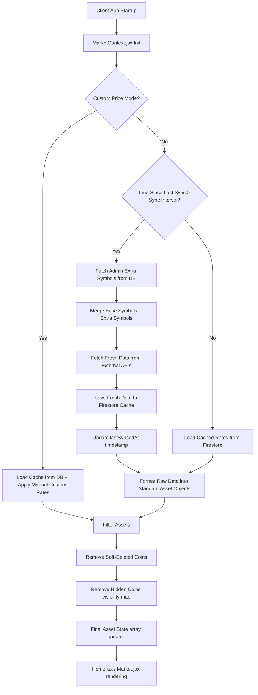

# Coins & Markets Tabs Working Flow

This document outlines the entire architecture, API endpoints, working flow, and database structure for the different asset categories (Cryptocurrency, Exchange, Metals, Stocks) in the trading application.

## 1. Asset Categories and API Endpoints

The platform supports four primary asset categories, each powered by a different API for real-time market data.

### Cryptocurrency
- **API Provider:** LiveCoinWatch
- **Endpoint:** `POST https://api.livecoinwatch.com/coins/map`
- **Data Flow:** Sends an array of coin codes (e.g., `["BTC", "ETH", "SOL"]`) and receives current rates, 24h change, and volume.

### Foreign Exchange (Forex)
- **API Provider:** Metals.dev
- **Endpoint:** `GET https://api.metals.dev/v1/latest?api_key=...&currency=USD&unit=toz`
- **Data Flow:** The same `metals.dev` endpoint returns both precious metals and global fiat exchange rates (e.g., `GBP`, `EUR`, `JPY`) relative to USD. The app extracts the fiat currencies from the `currencies` object in the response to populate the Forex tab.

### Precious Metals
- **API Provider:** Metals.dev
- **Endpoint:** `GET https://api.metals.dev/v1/latest?api_key=...&currency=USD&unit=toz`
- **Data Flow:** Fetches spot prices per Troy Ounce (toz) for Gold, Silver, Platinum, Palladium, etc.

### Stocks
- **API Provider:** TwelveData
- **Endpoint:** `GET https://api.twelvedata.com/price?symbol=AAPL,AMZN,TSLA&apikey=...`
- **Data Flow:** Fetches real-time price quotes for provided stock ticker symbols.

---

## 2. Database Structure (Firestore)

The system relies heavily on Firebase Firestore to cache API responses (reducing external API calls), store custom configurations, and manage admin overrides.

### `admin_set` Collection
- **`coins_config`**: Stores the global synchronization settings.
  - `syncIntervalSeconds` (e.g., `300` for 5 minutes).
  - `lastSyncedAt` timestamp.
  - `useCustomPrice` boolean (if `true`, APIs are ignored and manual prices are used).
- **`coins_visibility`**: A key-value map holding boolean visibility states for assets (e.g., `{ "BTCUSDT": true, "stock-AAPL": false }`).
- **`coins_custom_rates`**: Holds the manually overridden prices set by the admin.

### Lists Collections
Stores extra symbols added by the admin and soft-deleted symbols.
- `coins_list_crypto / latest`
- `coins_list_forex / latest`
- `coins_list_metals / latest`
- `coins_list_stocks / latest`

### Rates Collections (Cache)
Stores the last successfully fetched API payloads so all connected clients can read from the database instead of exhausting API rate limits.
- `coins_rates_crypto / latest`
- `coins_rates_forex / latest`
- `coins_rates_metals / latest`
- `coins_rates_stocks / latest`

---

## 3. Working Flow & Syncing Logic

The core logic resides in `MarketContext.jsx`. The application utilizes a "Smart Load" mechanism to prevent API rate limiting.

1. **Load Global Configuration:** When the app loads, `MarketContext` reads the configuration, visibility, and cache documents from Firestore.
2. **Evaluate Sync Timer:** It calculates the elapsed time since the last sync: `Date.now() - config.lastSyncedAt`.
3. **If Time Expired (Needs Sync):**
   - The app merges default hardcoded symbols with extra symbols added by the admin.
   - It sends bulk requests to the respective APIs (LiveCoinWatch, TwelveData, etc.).
   - The fresh rates are pushed into the `coins_rates_...` cache documents on Firestore.
   - `lastSyncedAt` is updated in `admin_set/coins_config`.
4. **If Time NOT Expired (Use Cache):**
   - The app skips API calls completely.
   - It reads the previously saved rates directly from the Firestore cache documents.
5. **Apply Custom Overrides & Visibility:**
   - If `useCustomPrice` is `true`, it ignores the live rates and injects the manual rates from `admin_set/coins_custom_rates`.
   - The final array is filtered based on `admin_set/coins_visibility` and `deletedCoins`.
6. **Publish to Context:** The final sanitized array of assets is provided to all consuming components (e.g., `Home.jsx`, `Market.jsx`).

---

## 4. Admin Management Flow

### Add Flow
- The admin types a new symbol (e.g., `NFLX` for stocks) in `AdminCoinsSettings.jsx`.
- The symbol is pushed into the specific category's list document (e.g., `coins_list_stocks/latest` -> `stocks` array).
- On the next sync cycle, `MarketContext` reads this new symbol, includes it in the API request array, fetches its price, and adds it to the global cache.

### Delete Flow (Soft Delete)
- The admin clicks the delete icon next to an asset.
- The asset's unique ID is pushed into the `deletedCoins` array inside the respective list document.
- `MarketContext` filters out any asset whose ID exists in the `deletedCoins` array.

### Show / Hide Flow (Visibility Manager)
- The admin toggles the eye icon in the Visibility Manager tab.
- The toggle updates `admin_set/coins_visibility` on Firestore (setting the asset ID to `false`).
- `MarketContext` filters out assets marked as `false`. The asset data is still fetched/synced in the background, but it is not rendered on the client UI.

---

## 5. Architecture Diagram

